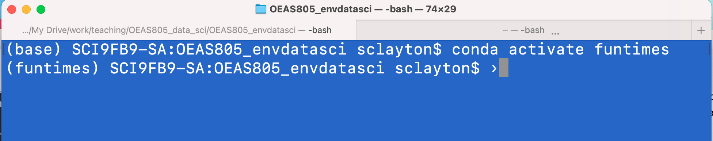

# Working with package managers and environments

A package manager is software that will keep track of your python (or R, etc...) version and any packages you want to use in your analytical pipelines. Any given project might require several packages along with their dependencies.   

The functionality of some packages may change as new versions are released, and so it is helpful to be able to keep track of which versions of which packages you are using for any given project. A package update can sometimes (often) result in parts of your code no longer functioning, and so having a way to create a "snapshot" of the combination of packages and their versions that all function together is very useful. This snapshot of packages and versions is called an environment, and you can create and share environments along with your code. This will allow you to reproduce your workflow even if you don't return to your analysis for several months (or years), to make your code fully reproducible and make it easier for anyone who wants to use your code to run it "out of the box".

## Conda
Conda is an open-source package and environment manager widely used by scientists and machine learning practitioners. Anaconda is built on top of conda, and so allows you to use all of the features of conda with some extra features like a GUI. I prefer conda :nerd_face:

Conda has several commands that will allow you to manage your python packages, summarized in this [cheatsheet](https://docs.conda.io/projects/conda/en/latest/_downloads/843d9e0198f2a193a3484886fa28163c/conda-cheatsheet.pdf). Below I outline some basic commands to get started with.

`conda list` will list the packages you have installed in your current environment. 

`conda install PACKAGE` will install a package (just replace `PACKAGE` with the name of the package you want to install)  
`conda update PACKAGE` will update a package  
`conda remove PACKAGE` will remove a package  

For both the `install`, `update` and `remove` commands, you can supply a list of more than one package

## Working with environments
It's a good idea to create a specific python environment for each of your projects. You can then save the information about your environment in a `requirements.txt` or `environment.yml` file (more about how to use those files later in the course).

To create a new environment, you will run the following command:
`conda create --name MYENV`  
this will create a new environment called 'MYENV'. 

You might also want to specify the version of python that you would like to use in your environment. For example you need to use Python 3.9, in which case you would issue the following command:
`conda create --name MYENV python=3.9`

To use your new environment, you need to activate it:  
`conda activate MYENV`  
Once you have activated your environment, you will see it in parentheses at the beginning of the command line prompt in your shell terminal like in the screenshot below:

If you'd like to share your environment, then you have a couple of options. You can save it to a `.txt` file. You will need to do this while you are working within the environment!  
`conda list --explicit > myenv.txt`  
This will give you a very long list, as it lists each of the packages you added along with their dependencies. 
Here is an example of a `.txt` file containing the info the `funtimes` environment created in class.

You can also share your environment in a `.yml` file, which is a text file in data serialization language, YAML, commonly used for writing configuration files. Again, you will do this while you are workign within the environment you wish to export.
`conda env export > MYENV.yml`
Here is an example of a `.yml` file containing the info the `funtimes` environment created in class.

Once you have finished your session working in your environment, then you can deactivate it:
`conda deactivate`
