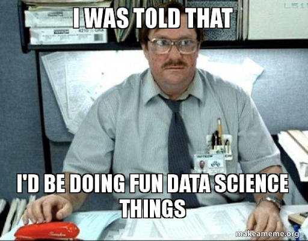
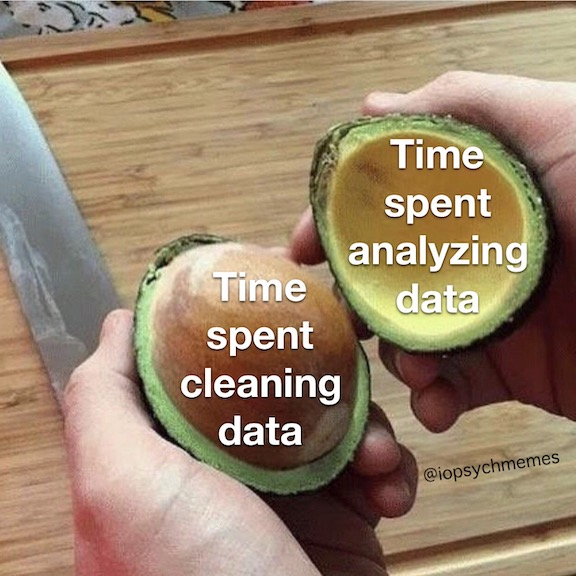

Before we delve into the exciting world of data repositories, databases, visualizations and building ML models... let's talk a little about project workflow and organization. Last week we spent some time talking about data and how to ensure that it is FAIR, and using version control tools to track changes in, collaborate on and share code projects. Now we're going to move on to thinking about whole data analysis projects and how to keep them from getting unwieldy.

# Data science workflow
Your research projects, whether you think of them as specific "data science" projects or not, will follow a pretty similar life cycle. Understanding this project lifecycle allows you to better structure your project folders/files.

* **Data Collection:** this might involve you going into the field or the lab to collect/generate the data yourself, you might scrape data from the web to build a new database, or you might obtain datasets from existing databases such as those supported by NOAA, NASA, NSF, etc...

* **Data Cleaning:** in an ideal world, the data that you collect in the data collection step above will be beautiful, consistent, gapless, well documented, saved in a format that is easy to work with... this is pretty much never the case. Even when you generate the data yourself. Data cleanning often takes up a large chunk of the time spent working on a data science project.

* **Exploratory Data Analysis (EDA):** Now that you have your data and you've spent some time getting it "clean", you can move on to more substantive data exploration. In practice, you will find that you end up going back and forth between Data Cleaning and EDA until you are happy that your data really is clean. EDA is all about getting a good understanding of your data, and involves generating descriptive statistics and data visualizations. The insights that you gain through this stage of the process will help you decide how best to model your data.

* **Model Development:** In this stage you will build models and evaluate them based on the understanding of your data developed as result of your EDA.  We'll talk about this in detail later in the course.

* **Model Deployment:** Once you have tested your (often several) model formulations and found one that performs optimally, then you will deploy it. This might be as basic as writing up a paper describing the formulation and results from your model and sharing it on GitHub (as we will do in this class), or could be as involved as setting up a web dashboard that displays continually updated model results based on streaming data in real time.