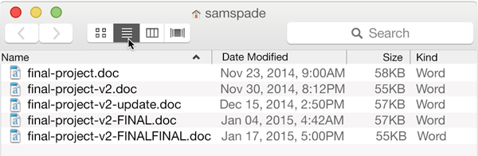

# Version control, git and GitHub

Topics: version control, git, GitHub

## What is version control?
Version control allows you to track changes to a collection of files. This could be code that you are using for your research (e.g. climate models like [MITgcm](https://mitgcm.org/source-code/)), but increasingly version control systems are also being used to track changes and updates to documentation (e.g. [OceanGliders](https://github.com/OceanGlidersCommunity)) and even track the development of manuscripts (e.g. [Overleaf history](https://www.overleaf.com/learn/how-to/Can_I_save_versions_of_my_work%3F), [Google Docs version history](https://support.google.com/a/users/answer/9308971?hl=en)).

Version control allows you to:
- see all of the changes made to a project over time (and compare versions)
- see who made which changes to the project
- retrieve previous versions of the project (e.g. commits and/or checkpoints)
- test experimental code features on a separate "branch" before integrating them into the main codebase
- save yourself many headaches and keep your work well organised

